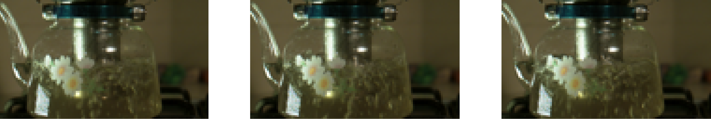
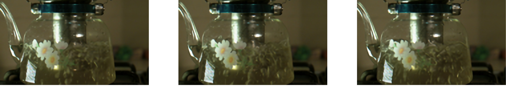
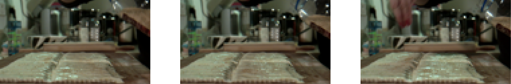
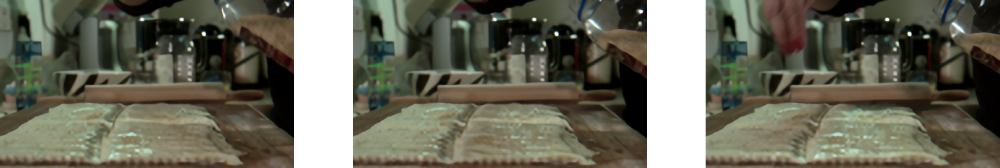
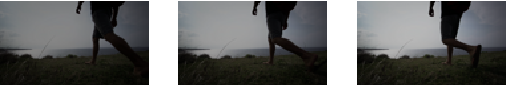
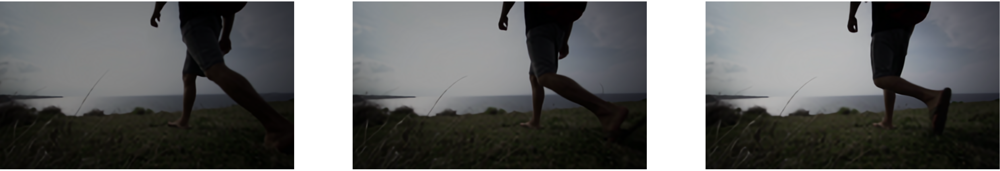
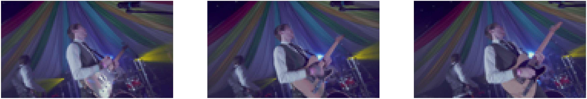
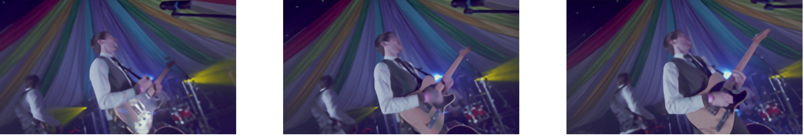

# Controlled_VSR

Pytorch Code for Video Super resolution using Control Nets and Optical Flow.

We adapt [SRGAN model](https://github.com/Lornatang/SRGAN-PyTorch) to videos using control nets.


## Loading and running the model on sample data

Setup the requirements as given in `requirements.txt` and `SRGAN_Pytorch/requirements.txt`

Download the weights for the SRGANx4 model by running the script
```bash
bash SRGAN_Pytorch/scripts/download_weights.sh SRGAN_x4-SRGAN_ImageNet
```

Then, we can load the model as following:
- For Controlled SRGAN with optical flow
```
from models import ControlledSRResNetWithFlow

model = ControlledSRResNetWithFlow(path_to_weights = <path_to_downloaded_weights>)
```

- For Controlled SRGAN without optical flow

```
from models import ControlledSRResNetWithFlow

model = ControlledSRResNet(path_to_weights = <path_to_downloaded_weights>)
```

The model accepts a tensor of shape: `N*T*C*H*W`, and upsamples it to a tensor of shape `N*T*C*(4H)*(4W)`
#### Using pre-trained weights

To use pre-trained weights, load the models from checkpoints as following:

- For Controlled SRGAN with optical flow
```
chkpoint = torch.load('model_checkpoints/crs_net_with_flow.pth')

model.load_state_dict(chkpoint['model'])
```

- For Controlled SRGAN without optical flow
```
chkpoint = torch.load('model_checkpoints/crs_net.pth')

model.load_state_dict(chkpoint['model'])
```

## Training the model

To download Vimeo90k dataset,

```
python download_data.py
```
change the directory in the download_data.py file to save to a preferred location, defaults to './data'.

To run training for the Model:

```
python script.py config.yaml <current-timestamp>
```

## Sample frames
- Sample 1



- Sample 2



- Sample 3



- Sample 4


